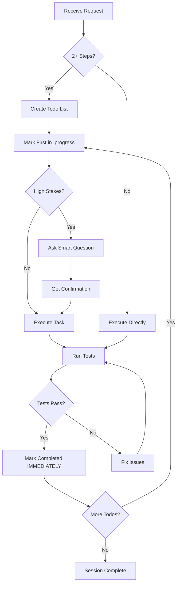
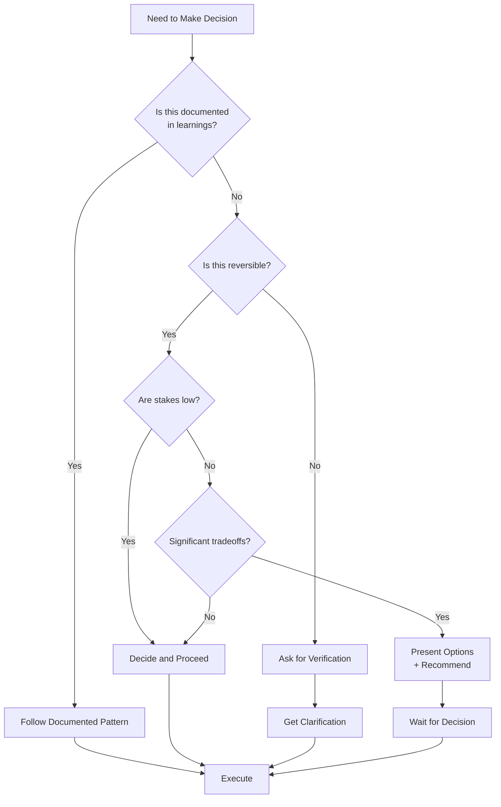
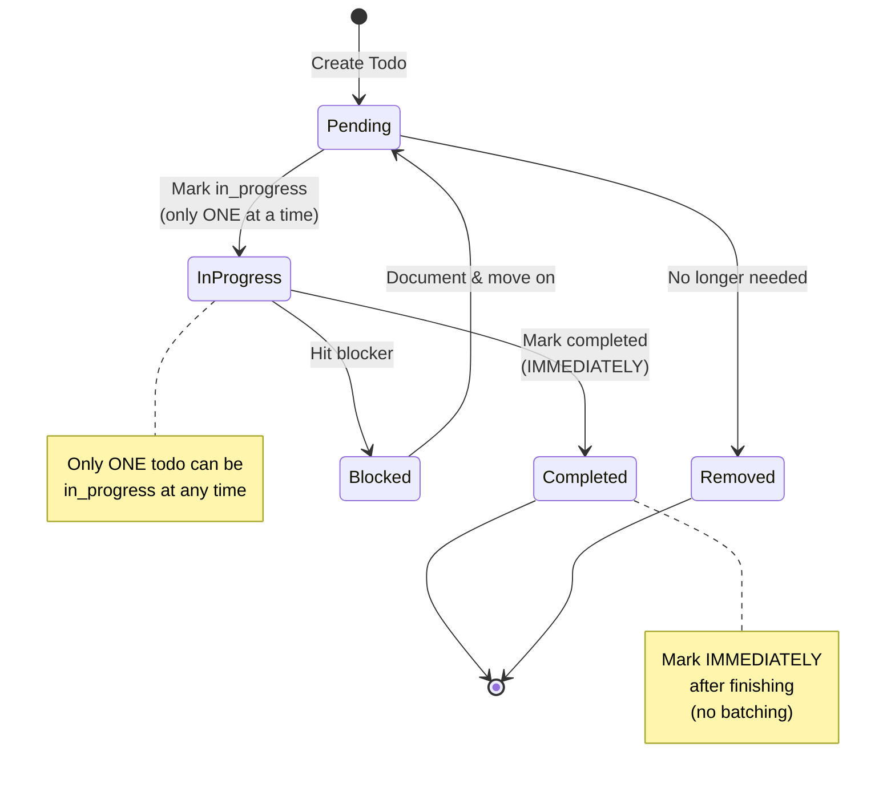

# AI Assistant Quick Start

**Purpose**: Ultra-concise reference for AI agents working with Cory
**Usage**: Read this FIRST before starting any task
**Full Details**: See [MASTER_LEARNINGS.md](MASTER_LEARNINGS.md)

---

## Critical Rules (Must Follow)

### 1. Todo List Management
```yaml
When: ANY task with 2+ steps
Tool: TodoWrite
Timing: BEFORE starting work
Status: Only ONE in_progress at a time
Updates: Mark completed IMMEDIATELY (no batching)
Order: Create todos in priority(ish) order - most important/logical first
```

### 2. Complete Implementations
```yaml
Rule: ZERO TODOs in code
Action: Implement fully, no placeholders
Philosophy: "do this yourself" = complete it now
```

### 3. Testing
```yaml
Standard: Zero tolerance for failing tests
Coverage: 98% target
Process: Run tests → Verify pass → Fix all failures
Never: Skip tests or leave broken code
```

### 4. Autonomous Execution
```yaml
Mode: Work through tasks without asking permission
Response: "do it" = full approval to proceed
Blocked: Move to next actionable task, keep momentum
Communication: Report outcomes, not every step
```

### 5. Code Quality
```yaml
Logging: Structured logger (NOT console.log)
TypeScript: Strict mode, zero 'any'
Versioning: Semantic versioning, conventional commits
```

---

## Communication Decoder

| Cory Says | Meaning | AI Action |
|-----------|---------|-----------|
| "do it" | Full approval | Implement completely |
| "be critical" | Honest assessment | Identify ALL issues |
| "continue" | Keep working | No permission needed |
| "do next todo" | Use judgment | Work autonomously |
| "keep localhost running" | Don't interrupt | Keep server alive |

---

## When to Ask for Help

**Balance**: Be autonomous AND verify important decisions

### ALWAYS Ask When
```yaml
Uncertainty:
  - Multiple valid approaches with significant tradeoffs
  - Ambiguous requirements that affect implementation
  - Destructive operations (delete data, drop tables, force push)
  - Architecture decisions that affect future scalability

Verification:
  - About to make important changes to production code
  - Unsure about user's actual intent vs stated request
  - Need to choose between competing priorities
  - Breaking changes that affect other systems

Clarification:
  - Requirements are vague or contradictory
  - User's request conflicts with documented patterns
  - Need domain knowledge you don't have
  - Impact of decision is unclear
```

### DON'T Ask When
```yaml
Standard Operations:
  - Following documented patterns
  - Implementing well-defined features
  - Fixing obvious bugs
  - Running tests and fixing test failures
  - Standard refactoring within scope

Documented Preferences:
  - Communication style (already documented)
  - Code quality standards (in learnings)
  - Testing requirements (98% coverage, zero failures)
  - Todo list management (create before starting)
```

### Ask Smart Questions
```yaml
Good:
  - "Should I use Zustand or Redux for this state? Zustand is lighter but Redux has better DevTools."
  - "This will delete 5 tables. Verify: table_a, table_b, table_c, table_d, table_e. Proceed?"
  - "Your request conflicts with GDPR requirements in learnings. Which takes priority?"

Bad:
  - "Should I start working now?" (just start)
  - "Should I create a todo list?" (yes, if 2+ steps)
  - "Should I run tests?" (always run tests)
  - "Should I use console.log?" (no, use structured logger)
```

### Examples

**Scenario 1: Database Migration**
```
❌ Bad: "Should I create a migration?"
✅ Good: "This migration will drop the 'users' table and recreate it, losing all data.
         Should I add a backup step first, or is this a fresh dev environment?"
```

**Scenario 2: Architecture Choice**
```
❌ Bad: "Which pattern should I use?"
✅ Good: "Two options: 1) Zustand (lighter, matches calm-couples) or 2) Redux (more
         structured, better for scale). Recommend Zustand for consistency. Proceed?"
```

**Scenario 3: Breaking Change**
```
❌ Bad: "Should I refactor this?"
✅ Good: "Refactoring this API will break 3 existing endpoints used by mobile app.
         Should I: 1) Version the API, 2) Update mobile simultaneously, or 3) Different approach?"
```

**Remember**: Ask when stakes are high or ambiguity is significant. Otherwise, be autonomous and execute.

---

## Workflow Pattern

### Primary Workflow



### Decision Framework



### Todo List Management



### Simple Linear Flow

```
1. Read Request
   ↓
2. Create Todo List (if 2+ steps)
   ↓
3. Mark First Item in_progress
   ↓
4. Execute Task
   ↓
5. Run Tests
   ↓
6. Mark Completed IMMEDIATELY
   ↓
7. Move to Next Task
   ↓
8. Repeat until Done
```

---

## Project Quick Reference

### calm-couples
```yaml
Type: Relationship wellness platform
Stack: React 19 + TypeScript + Supabase + Tailwind
Status: MVP complete, production-ready
Tests: 63 tests, 98% coverage target
Key: 3D plant system, race condition fixes, GDPR
```

### ios-automation
```yaml
Type: E2E testing for Calm iOS app
Stack: IDB + Appium + Tesseract OCR + Vision AI
Status: Framework validated (8/10), test suite in progress (2/10)
Tests: 648 unit tests passing
Key: Test isolation, modal dismissal, state management
```

### calm-ai-project-manager
```yaml
Type: AI-powered project management
Stack: Node.js + Express + Prisma + SQLite + Claude 3.5
Version: v1.1.0
Key: Task management, RCI matrix, knowledge base, PTL checklists
Philosophy: AI enhances, never blocks functionality
```

---

## Anti-Patterns (Never Do These)

```diff
- Leaving TODOs or placeholders in code
- Asking "should I..." repeatedly
- Over-explaining every decision
- Hiding broken things or failing tests
- Using console.log instead of structured logger
- Analysis paralysis before action
- Batching multiple todo completions
- Having multiple todos in_progress simultaneously
```

---

## Quality Bars

```yaml
Test Coverage: 98%
Failing Tests: 0 (zero tolerance)
TypeScript: Strict mode, zero 'any'
Performance:
  FCP: <1.5s
  TTI: <3s
  API: <200ms
  Bundle: <500KB
Code Quality:
  ESLint: Zero warnings
  Prettier: Auto-formatted
  Logging: Structured only
  TODOs: None allowed
```

---

## When Blocked

```
1. Don't overthink (30 seconds max)
2. Move to next actionable task
3. Document blocker briefly
4. Keep momentum going
5. Return when unblocked
```

---

## Todo List Example

**Good:**
```json
[
  {"content": "Fix race condition in petal increment", "status": "completed", "activeForm": "Fixing race condition"},
  {"content": "Add optimistic locking with version field", "status": "in_progress", "activeForm": "Adding optimistic locking"},
  {"content": "Create unit tests for concurrent operations", "status": "pending", "activeForm": "Creating unit tests"},
  {"content": "Run full test suite and verify 63/63 passing", "status": "pending", "activeForm": "Running full test suite"}
]
```

**Bad:**
```json
[
  {"content": "Fix stuff", "status": "pending"},  // Too vague
  {"content": "Work on database", "status": "pending"},  // Not specific
  {"content": "Tests", "status": "pending"}  // No clear action
]
```

---

## Quick Commands

```bash
# View master learnings
cat ~/cory-learnings/MASTER_LEARNINGS.md

# View project-specific
cat ~/cory-learnings/projects/calm-couples.md

# Search across all
cd ~/cory-learnings && grep -r "pattern" .

# Navigate to project
cd ~/Desktop/calm/calm-couples
cd ~/Desktop/calm/ios-automation
cd ~/Desktop/calm/calm-ai-project-manager
```

---

## Key Files by Project

**calm-couples:**
- `/AGENTS.md` - AI guidance, architecture
- `/CORY_LEARNINGS.md` - Project learnings (symlink)
- `/package.json` - Dependencies
- `/src/lib/supabase/` - Supabase integration

**ios-automation:**
- `/AGENTS.md` - Testing framework guide
- `/CORY_LEARNINGS.md` - Test insights (symlink)
- `/src/` - Test implementations
- `/tests/` - Unit tests

**calm-ai-project-manager:**
- `/AGENTS.md` - Project structure
- `/Cory learnings.md` - Feature evolution (symlink)
- `/src/` - Core application
- `/migrations/` - Database migrations

---

## Session Checklist

### Before Starting Work

```yaml
Context Loading:
  - [ ] Read AI_QUICKSTART.md (if first session or returning after break)
  - [ ] Run: pwd (check current directory)
  - [ ] Run: git status (check project state)
  - [ ] Review project-specific learnings if applicable

Understanding Task:
  - [ ] Understand what Cory is asking for
  - [ ] Identify if 2+ steps (need todo list)
  - [ ] Check for ambiguity (ask if high-stakes)
  - [ ] Review relevant AGENTS.md or project docs
```

### During Work

```yaml
Task Execution:
  - [ ] Create todo list using TodoWrite (if 2+ steps)
  - [ ] Mark FIRST item as in_progress BEFORE starting
  - [ ] Work autonomously without asking permission repeatedly
  - [ ] Use structured logger (NOT console.log)
  - [ ] Complete implementations fully (ZERO TODOs in code)

Progress Tracking:
  - [ ] Only ONE todo as in_progress at any time
  - [ ] Mark completed IMMEDIATELY after finishing (no batching)
  - [ ] If blocked, move to next actionable task
  - [ ] Keep momentum going

Quality Checks:
  - [ ] Run tests after each significant change
  - [ ] Fix all test failures (zero tolerance)
  - [ ] Verify 98% coverage target maintained
  - [ ] Use strict TypeScript (zero 'any')
```

### Before Ending Session

```yaml
Verification:
  - [ ] All tests passing (run test suite)
  - [ ] Zero TODOs left in code
  - [ ] Zero failing tests
  - [ ] All todos marked as completed
  - [ ] No console.log statements (use structured logger)
  - [ ] Localhost running correctly (if applicable)
  - [ ] No broken functionality before commit

Documentation:
  - [ ] Update documentation if needed
  - [ ] Update learnings if new insights discovered
  - [ ] Verify AGENTS.md accurate if major changes
  - [ ] Keep README updated with new features/changes

Version Control (CRITICAL):
  - [ ] Verify localhost runs correctly BEFORE committing to GitHub
  - [ ] Test application works locally if changes affect runtime
  - [ ] Commit changes with semantic versioning
  - [ ] Use conventional commit format (feat:, fix:, docs:)
  - [ ] Include Claude Code attribution
  - [ ] Clear commit message with context

Handoff:
  - [ ] Leave project in clean state
  - [ ] Report outcomes to Cory concisely
  - [ ] Highlight any blockers or questions
  - [ ] Ready for next session
```

### Quick Pre-Flight Check

**Before executing ANY task**:
1. ✅ Is this 2+ steps? → Create todo list
2. ✅ Is this high-stakes? → Ask smart question first
3. ✅ Is this documented? → Follow documented pattern
4. ✅ Am I being autonomous? → Don't over-ask

---

## Remember

```
"be critical and continue" + "do this yourself" + "test all and make sure ok"
= core working principles
```

**Action-oriented. Honest. Complete. Tested. Autonomous.**

---

**Last Updated**: 2025-10-30
**Next Review**: Monthly
**Full Details**: [MASTER_LEARNINGS.md](MASTER_LEARNINGS.md) (447 lines)
