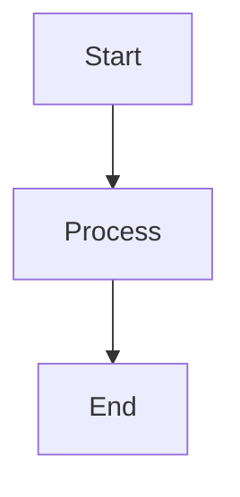

# Term Dictionary

**Comprehensive terminology reference for Cory's development workflow and Calm projects.**

**Purpose**: Single source of truth for technical terms, project-specific concepts, and workflow terminology used across all projects.

---

## Table of Contents

- [Development Workflow](#development-workflow)
- [Version Control](#version-control)
- [Testing & Quality](#testing--quality)
- [Project-Specific Terms](#project-specific-terms)
- [Tools & Frameworks](#tools--frameworks)
- [Architecture & Design](#architecture--design)
- [Claude Code Concepts](#claude-code-concepts)

---

## Development Workflow

### Auto-Load System
**Definition**: Bash script system that automatically injects cory-learnings into every Claude Code session via user-prompt-submit hook.

**Location**: `~/.claude/scripts/auto-load-learnings.sh`

**Purpose**: Ensures AI agents always have access to preferences without manual loading.

**Related**: [Claude Code Hooks](#claude-code-hooks), [User Prompt Submit Hook](#user-prompt-submit-hook)

---

### Branch Coordination
**Definition**: Strategy for managing multiple git branches when using multi-window workflow.

**Best Practice**: Each Claude window works on different branch to prevent conflicts.

**Example**:
- Window 1: `feature/auth` (authentication)
- Window 2: `fix/race-condition` (bug fix)
- Window 3: `docs/readme` (documentation)

**Related**: [Multi-Window Workflow](#multi-window-workflow)

---

### Interface Verification
**Definition**: 4-step process to verify web interfaces work correctly after code changes.

**Steps**:
1. Start development server
2. Verify URL responds (curl/browser)
3. Check expected behavior (UI, API calls, no errors)
4. Report detailed status

**Critical**: "Run interface" means ALL 4 steps, not just starting the server.

**Related**: [Expected Behavior](#expected-behavior)

---

### Multi-Window Workflow
**Definition**: Using multiple Claude Code windows simultaneously on same repository.

**Benefits**:
- Work on different features in parallel
- No performance impact (each window independent)
- Coordinated via ACTIVE_TODOS.md

**Requirements**:
- Different branches per window (recommended)
- Coordination via ACTIVE_TODOS.md
- Frequent git pulls to stay in sync

**Related**: [Branch Coordination](#branch-coordination), [ACTIVE_TODOS.md](#active_todosmd)

---

### Port Management
**Definition**: System for assigning unique localhost ports to each project to prevent conflicts.

**Port Assignments**:
- **calm-couples**: http://localhost:3000
- **ios-automation**: http://localhost:4000
- **calm-ai-project-manager**: http://localhost:3001

**Rule**: Each project MUST run on different port.

---

### Semantic Versioning
**Definition**: Version numbering system using MAJOR.MINOR.PATCH format.

**Format**: `vMAJOR.MINOR.PATCH` (e.g., v2.4.0)

**Rules**:
- **MAJOR**: Breaking changes (v1.0 → v2.0)
- **MINOR**: New features, backward compatible (v2.1 → v2.2)
- **PATCH**: Bug fixes, backward compatible (v2.2.0 → v2.2.1)

**Example**: cory-learnings v2.4.0 (major=2, minor=4, patch=0)

---

### Structured Logging
**Definition**: Logging format using consistent component + action + metadata pattern.

**Format**: `[Component] Action - Metadata`

**Example**: `[AuthService] User login - userId: 123, timestamp: 2025-10-31`

**Benefits**: Easier debugging, better searchability, consistent format.

---

### Symlinks (Symbolic Links)
**Definition**: File system links that point from project directories to central cory-learnings files.

**Purpose**: Share learnings across projects without duplication.

**Example**:
```bash
~/Desktop/calm/calm-couples/CORY_LEARNINGS.md → ~/cory-learnings/projects/calm-couples.md
```

**Verification**: Use `scripts/check-symlinks.sh` to verify all symlinks working.

---

### TodoWrite
**Definition**: Claude Code tool for creating and managing structured todo lists during coding sessions.

**Rules**:
- Use for ANY 2+ step task
- ONE todo in_progress at a time
- Mark completed IMMEDIATELY after finishing
- Create BEFORE starting work (not during)

**Status Options**: `pending`, `in_progress`, `completed`

**Related**: [ACTIVE_TODOS.md](#active_todosmd)

---

## Version Control

### Conventional Commits
**Definition**: Git commit message format following structured conventions.

**Format**: `type(scope): description`

**Types**:
- `feat:` - New feature
- `fix:` - Bug fix
- `docs:` - Documentation only
- `test:` - Adding/updating tests
- `refactor:` - Code refactoring
- `chore:` - Maintenance tasks

**Example**: `feat(auth): add JWT token validation`

---

### Git Hooks
**Definition**: Scripts that run automatically at specific points in git workflow (e.g., pre-commit, pre-push).

**Common Uses**:
- Run tests before commit
- Lint code before commit
- Validate commit message format
- Run builds before push

**Related**: [Claude Code Hooks](#claude-code-hooks)

---

## Testing & Quality

### Code Coverage
**Definition**: Percentage of code executed during test runs.

**Target**: Minimum 80% coverage (Cory's projects aim for 98%+)

**Measurement**: Lines of code tested / total lines of code

**Example**: calm-couples has 79% coverage (63 tests)

---

### E2E Tests (End-to-End Tests)
**Definition**: Tests that validate entire user workflows from start to finish.

**Example**: User signup → login → create item → logout

**vs Unit Tests**: E2E tests full workflows, unit tests test individual functions.

**Projects**:
- ios-automation: 3 E2E tests
- calm-couples: E2E tests for core user journeys

---

### Expected Behavior
**Definition**: Specific observable outcomes that should occur when interface/feature works correctly.

**Examples**:
- Page loads without errors
- No console errors in browser dev tools
- Key UI elements render correctly
- API calls succeed (check network tab)
- No 404s for assets

**Critical**: Part of [Interface Verification](#interface-verification) step 3.

---

### Test Coverage Target
**Definition**: Minimum acceptable percentage of code coverage for project.

**Cory's Standard**: 98% test coverage

**Enforcement**: Tests must pass before committing to GitHub.

---

### Unit Tests
**Definition**: Tests that validate individual functions or components in isolation.

**vs E2E Tests**: Unit tests test single functions, E2E tests test full workflows.

**Example**: Testing a single function that calculates tax vs testing entire checkout flow.

**Stats**:
- ios-automation: 648 unit tests passing
- calm-ai-project-manager: 105+ test cases

---

## Project-Specific Terms

### ACTIVE_TODOS.md
**Definition**: Markdown file in each repository that persists todo context across Claude Code sessions.

**Purpose**: Todo lists don't persist between Claude conversations - this file preserves context.

**Location**: Root of each project repository + ~/cory-learnings/

**Format**: Includes project context, port, pending todos, in-progress work, completed items.

**Related**: [TodoWrite](#todowrite), [Multi-Window Workflow](#multi-window-workflow)

---

### calm-ai-project-manager
**Definition**: AI-powered project management system built with Node.js + Prisma.

**Port**: http://localhost:3001

**Stack**: Node.js, Express, Prisma, PostgreSQL

**Status**: Production-ready (v1.5.0)

**Tests**: 105+ test cases

**Key Features**: AI-powered task management, intelligent prioritization, time tracking.

---

### calm-couples
**Definition**: Relationship wellness platform built with React + Supabase.

**Port**: http://localhost:3000

**Stack**: React, TypeScript, Tailwind CSS, Supabase

**Status**: MVP complete, production-ready

**Tests**: 63 tests passing, 79% coverage

**Key Features**: Plant garden (3D isometric view), petal system, relationship tracking.

---

### ios-automation
**Definition**: iOS E2E testing framework built with IDB + Appium.

**Port**: http://localhost:4000

**Stack**: TypeScript, IDB (iOS Device Bridge), Appium, WebDriverIO

**Status**: Active development

**Tests**: 648 unit tests, 3 E2E tests, 261 total test cases documented

**Key Features**: iOS device automation, screenshot comparison, accessibility testing.

---

### Petal System
**Definition**: Core feature in calm-couples where users earn "petals" for relationship activities.

**Purpose**: Gamification of relationship wellness activities.

**Visual**: Petals appear in plant garden as 3D isometric flowers.

---

### Plant Garden
**Definition**: 3D isometric visualization in calm-couples showing relationship progress.

**Features**: Plants grow based on user activity, petals earned, visual progress tracking.

---

## Tools & Frameworks

### Appium
**Definition**: Mobile automation framework for iOS and Android.

**Used In**: ios-automation

**Purpose**: Automate iOS device interactions for E2E testing.

**Related**: [IDB](#idb-ios-device-bridge)

---

### IDB (iOS Device Bridge)
**Definition**: Facebook's command-line tool for iOS device automation.

**Used In**: ios-automation

**Purpose**: Low-level iOS device control, screenshot capture, UI inspection.

**Related**: [Appium](#appium)

---

### Prisma
**Definition**: Next-generation ORM (Object-Relational Mapping) for Node.js and TypeScript.

**Used In**: calm-ai-project-manager

**Purpose**: Type-safe database access, schema migrations, query building.

**Key Features**: Auto-generated types, schema-first design, migration system.

---

### Supabase
**Definition**: Open-source Firebase alternative with PostgreSQL database.

**Used In**: calm-couples

**Features**: Authentication, real-time subscriptions, PostgreSQL database, REST API, storage.

**Benefits**: Self-hosted option, PostgreSQL power, built-in auth.

---

### TypeScript
**Definition**: Strongly-typed superset of JavaScript.

**Used In**: All Calm projects (calm-couples, ios-automation, calm-ai-project-manager)

**Benefits**: Type safety, better IDE support, catch errors at compile time.

**Cory's Standard**: TypeScript strict mode enabled.

---

## Architecture & Design

### Mermaid Diagrams
**Definition**: Text-based diagram syntax that renders visual flowcharts in markdown.

**Supported**: GitHub, GitLab, VS Code, many markdown viewers.

**Example**:


**Used In**: MASTER_LEARNINGS.md for workflow visualization.

---

### REST API
**Definition**: Representational State Transfer - architectural style for web APIs.

**Characteristics**: Stateless, resource-based URLs, HTTP methods (GET, POST, PUT, DELETE).

**Example**: `GET /api/users/123` retrieves user with ID 123.

**Used In**: calm-couples, calm-ai-project-manager.

---

### Type Safety
**Definition**: Programming language feature that prevents type errors at compile time.

**Implementation**: TypeScript with strict mode enabled.

**Benefits**: Catch bugs before runtime, better IDE autocomplete, self-documenting code.

**Cory's Standard**: All projects use TypeScript strict mode.

---

### YAML Frontmatter
**Definition**: Metadata block at start of markdown files using YAML syntax.

**Format**:
```yaml
---
title: "Document Title"
version: "1.0.0"
---
```

**Purpose**: Machine-readable metadata for documentation files.

**Used In**: All cory-learnings markdown files.

---

## Claude Code Concepts

### Claude Code Hooks
**Definition**: User-defined shell commands that execute in response to Claude Code events.

**Types**:
- `user-prompt-submit`: Runs before sending user message to Claude
- `tool-call`: Runs when Claude uses a tool
- `message-complete`: Runs after Claude finishes response

**Configuration**: VS Code settings → Claude Code → Hooks

**Related**: [User Prompt Submit Hook](#user-prompt-submit-hook)

---

### User Prompt Submit Hook
**Definition**: Specific Claude Code hook that runs before each user message is sent to Claude.

**Cory's Usage**: Auto-loads cory-learnings on every message via `~/.claude/scripts/auto-load-learnings.sh`.

**Benefit**: Ensures AI agents always have context without manual loading.

**Configuration**:
```bash
# In VS Code settings.json
"claudeCode.hooks.userPromptSubmit": "~/.claude/scripts/auto-load-learnings.sh"
```

**Related**: [Auto-Load System](#auto-load-system), [Claude Code Hooks](#claude-code-hooks)

---

## Quick Reference

### File Extensions
- `.md` - Markdown documentation
- `.ts` - TypeScript source file
- `.test.ts` - TypeScript test file
- `.sh` - Shell script
- `.json` - JSON configuration file
- `.yaml` / `.yml` - YAML configuration file

### Common Abbreviations
- **API** - Application Programming Interface
- **CLI** - Command Line Interface
- **E2E** - End-to-End (testing)
- **IDB** - iOS Device Bridge
- **MVP** - Minimum Viable Product
- **ORM** - Object-Relational Mapping
- **REST** - Representational State Transfer
- **TOC** - Table of Contents
- **UI** - User Interface
- **URL** - Uniform Resource Locator

---

## Usage Guidelines

### For AI Agents
1. **Reference this file** when encountering unfamiliar terms in cory-learnings
2. **Use exact terminology** from this dictionary in communication
3. **Update this file** when new terms are introduced
4. **Link to terms** using markdown references (e.g., [Term Name](#term-name))

### For Developers
1. **Consult before using** new technical terms
2. **Add new terms** as project evolves
3. **Keep definitions** concise and accurate
4. **Include examples** where helpful

### Maintenance
- **Update frequency**: Add terms as they're introduced
- **Version updates**: Increment version when significant terms added
- **Cross-references**: Link related terms together
- **Examples**: Include real examples from Calm projects

---

## Contributing

When adding new terms:
1. **Choose correct section** (workflow, tools, project-specific, etc.)
2. **Write clear definition** (1-2 sentences)
3. **Add examples** from real projects
4. **Link related terms** using markdown links
5. **Update version** and last_updated date
6. **Keep alphabetical** within each section

**Format**:
```markdown
### Term Name
**Definition**: Clear, concise definition.

**Example**: Real example from projects.

**Related**: [Related Term 1](#related-term-1), [Related Term 2](#related-term-2)
```

---

**Version**: 1.0.0 | **Last Updated**: 2025-10-31 | **Total Terms**: 50+
