# cory-learnings Architecture

## System Architecture Overview

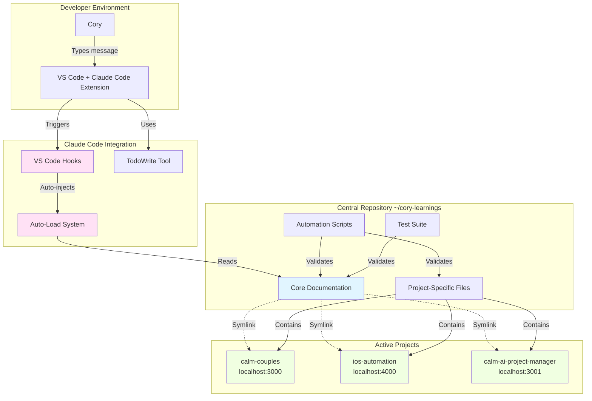

## Three-Tier Documentation Architecture

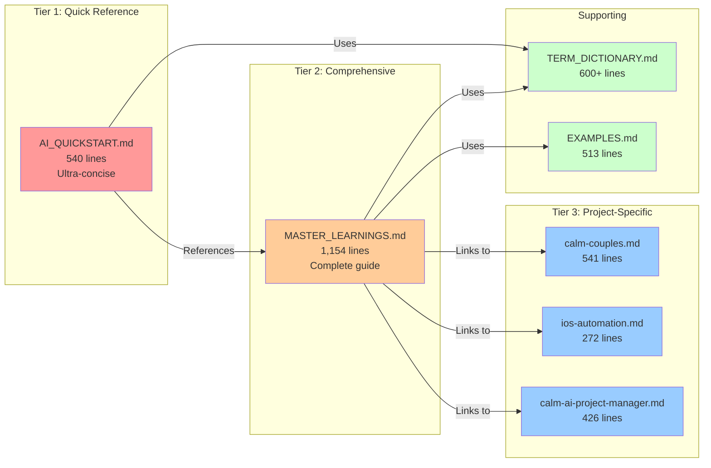

## Auto-Load System Flow

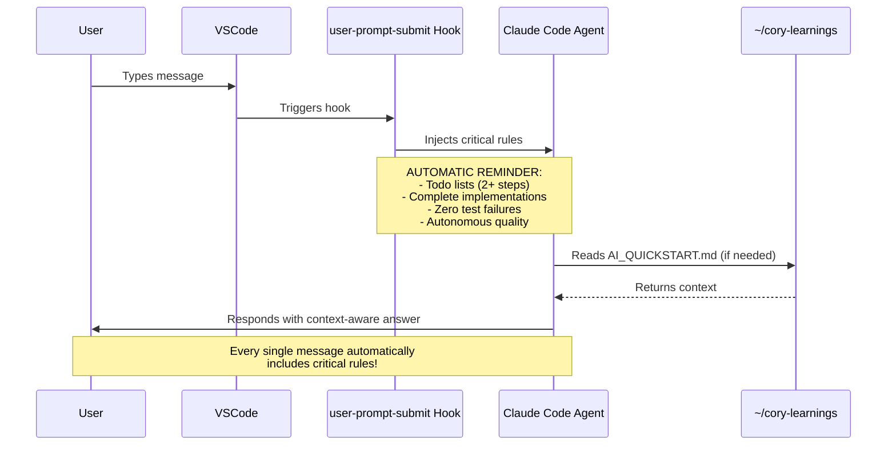

## Symlink Pattern

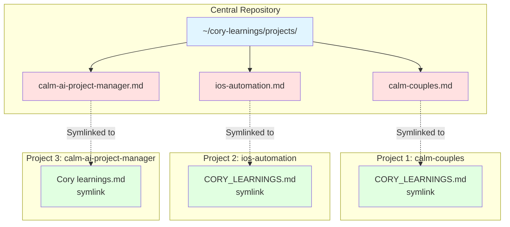

## Todo List State Machine

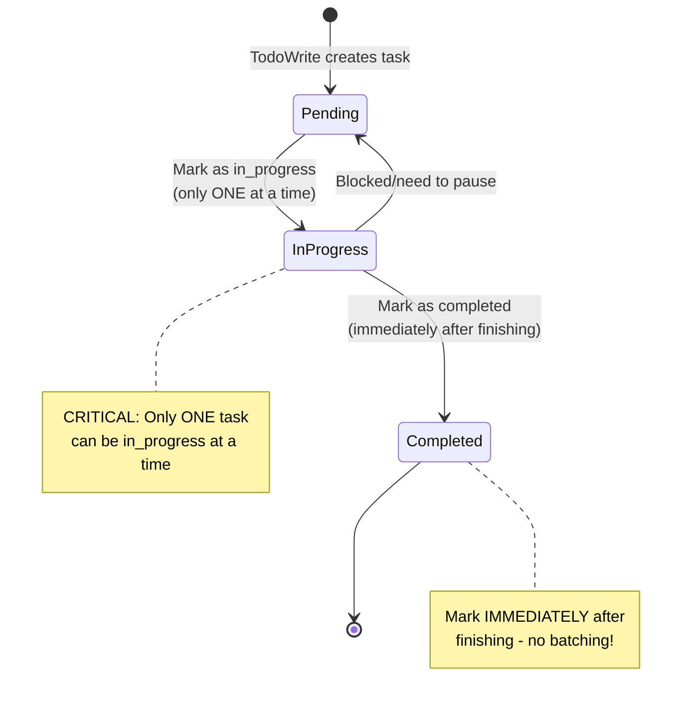

## Interface Verification Protocol (v2.4.0)

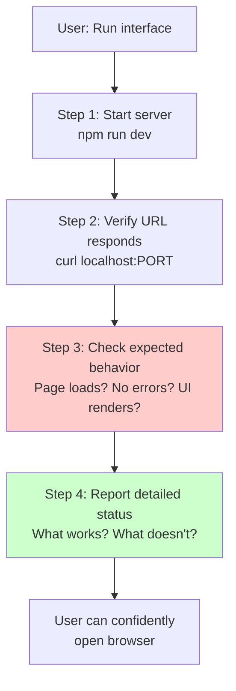

## Decision Framework: When to Ask vs Decide

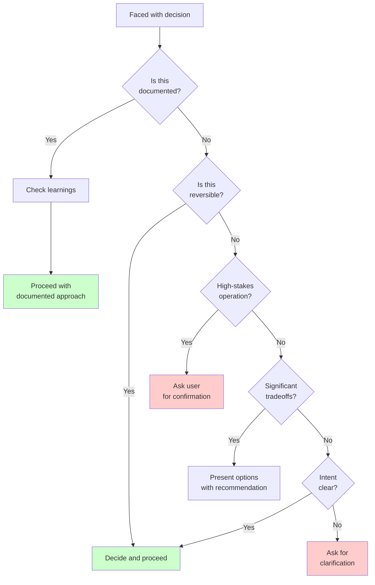

## Component Relationships

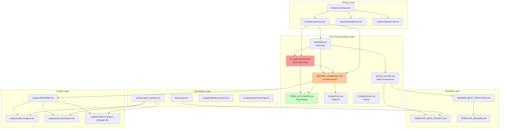

## Version Evolution Timeline

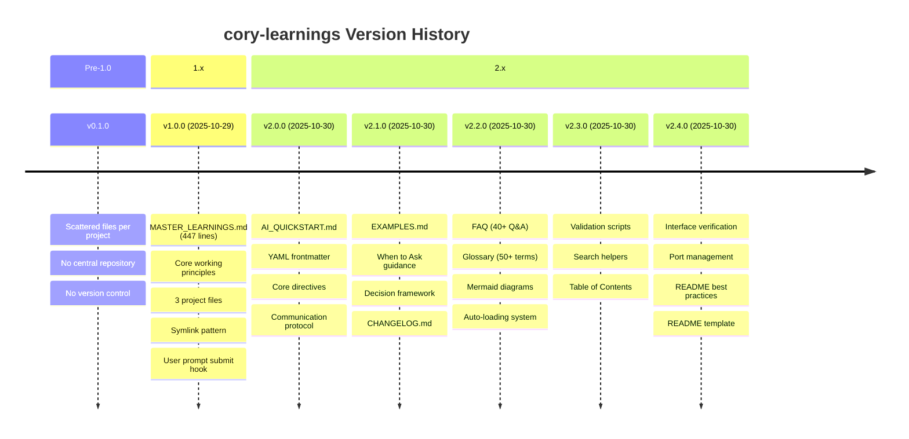

## Information Flow

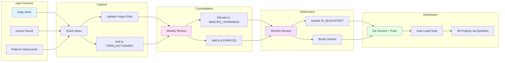

## Quality Assurance Architecture

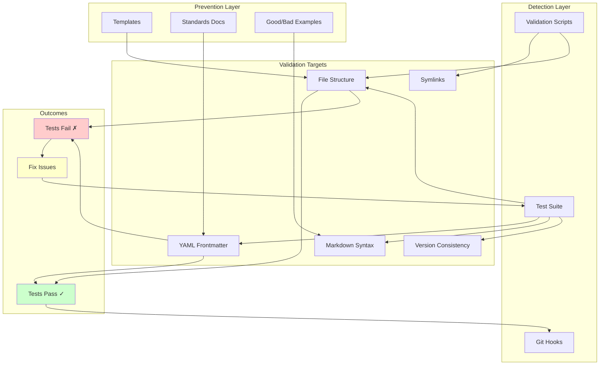

## Multi-Window Coordination

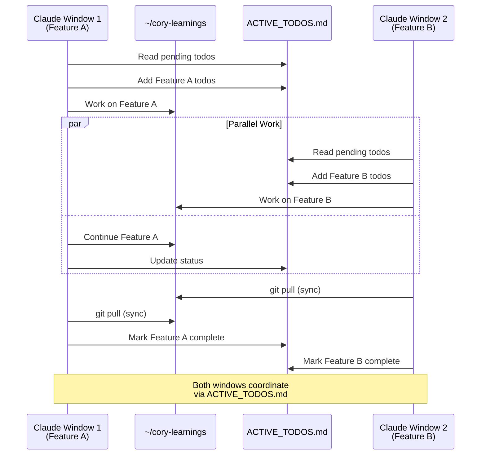

## Port Management Strategy

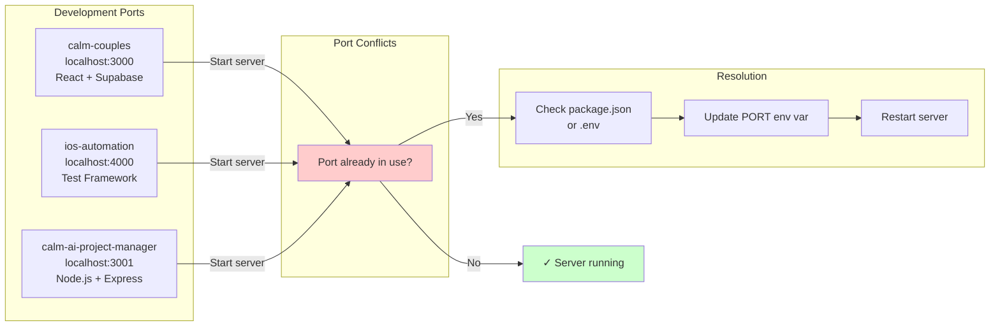

---

## Architecture Principles

### 1. Single Source of Truth
All preferences documented once in central repository, distributed via symlinks.

### 2. Automated Consistency
Hooks ensure every conversation has context without manual intervention.

### 3. Layered Complexity
Three tiers allow AI to load appropriate depth: quick, comprehensive, or project-specific.

### 4. Version Control
Git tracks evolution of preferences over time, enabling rollback and history analysis.

### 5. Validation First
Test suite prevents inconsistencies before they propagate.

### 6. Symlink Distribution
Edit once centrally, available everywhere via filesystem symlinks.

### 7. Zero External Dependencies
Pure bash + markdown = works everywhere, no installation required.

### 8. Progressive Enhancement
Start simple, add automation/validation/search tools as needed.

---

## Technology Decisions

### Why Markdown?
- Universal format
- Git-friendly (text-based diffs)
- Human-readable
- Supports YAML frontmatter for metadata
- Renders beautifully in VS Code and GitHub

### Why Bash Scripts?
- Available on macOS/Linux by default
- No dependencies to install
- Fast execution
- Perfect for file operations and validation

### Why YAML Frontmatter?
- Machine-readable metadata
- Enables programmatic validation
- Doesn't interfere with human readability
- Standard in documentation tools (Jekyll, Hugo, etc.)

### Why Symlinks?
- OS-level feature (no tools needed)
- Transparent to applications
- Single source of truth enforced at filesystem level
- Works with any text editor

### Why Claude Code Hooks?
- Automatic context injection
- Zero user effort required
- Consistent across all conversations
- Configured once, works forever

---

## Scalability Considerations

### Adding New Projects
```bash
./add-project.sh new-project ~/path/to/new-project
# Automatically creates project file + symlink
```

### Adding New Terms
Edit TERM_DICTIONARY.md, add to appropriate category.

### Growing Documentation
- Quick reference stays under 600 lines (fast loading)
- Comprehensive guide can grow indefinitely
- Project files isolated (no cross-contamination)

### Multi-Developer Support
- Fork repository per developer
- Customize preferences while preserving structure
- Merge common patterns back to team repo

---

## Future Architecture Enhancements

### Potential Additions
1. **Export Tools**: Generate PDF documentation
2. **Search API**: REST endpoint for querying learnings
3. **Analytics**: Track which rules are most referenced
4. **IDE Integration**: Deep VS Code extension integration
5. **Collaboration**: Multi-developer coordination tools
6. **AI Fine-tuning**: Export for model fine-tuning

### Architectural Constraints
- **No external dependencies**: Must remain pure bash + markdown
- **Fast loading**: AI_QUICKSTART must stay under 600 lines
- **Zero manual work**: Automation via hooks is non-negotiable
- **Backward compatibility**: New versions must not break existing projects

---

**End of Architecture Documentation**
